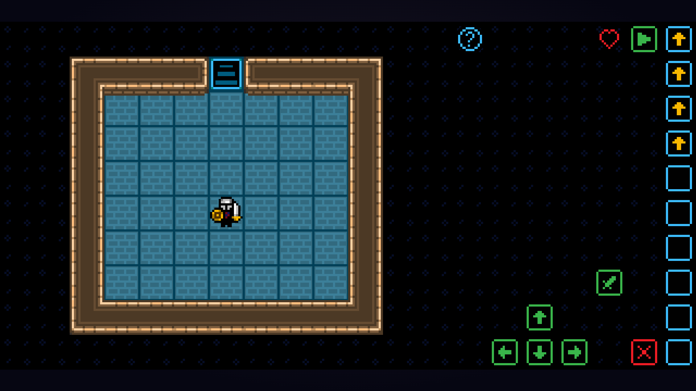

# Game-Based Learning Application  

This project is an educational game designed to teach fundamental programming concepts through interactive gameplay. Players learn key programming structures, including **variables, operators, loops, and conditional statements**, all explained using pseudocode in an engaging and structured manner.  

## Project Purpose  

This project demonstrates:  
- **Game-based learning methodologies** to teach programming interactively.  
- **Implementation of programming logic** in a game development environment.  
- **User engagement strategies** through level-based challenges and progression.  
- **Proficiency in GameMaker Studio 2** and its scripting language, **GML (GameMaker Language)**.  

## Prerequisites  

To run this project, you will need **GameMaker Studio 2**. The free edition can be downloaded from the official website:  

- [Download GameMaker Studio 2 (Free Edition)](https://www.yoyogames.com/get)

## How to Open the Project  

1. Download and install **GameMaker Studio 2**.  
2. Open GameMaker Studio 2.  
3. Click **"Open Project"** and navigate to the project folder.  
4. Select the file **`Game-Based-Learning-Application.yyp`** to load the project.  
5. Run the game within GameMaker Studio 2.  

---

## Game Overview  

The game consists of multiple levels, each introducing a **new programming concept**. Players progress by solving puzzles that require applying programming logic.  

### Features:  
- **Interactive Levels:** Each level introduces a new programming topic.  
- **Visual Programming Interface:** Players select inputs that execute like a program.  
- **Progression System:** Levels build on previous concepts to reinforce learning.  
- **Final Challenge:** Players complete a programming-based quiz to finish the game.  
- **Auto-Saving:** The game saves progress using a JSON file after each level.  

---

## Game Structure & Levels  

### 1. Main Menu  
The main menu provides the following options:  
- **Continue**: Resume a saved game.  
- **New Game**: Start a new playthrough.  
- **Quit**: Exit the game.  

*Screenshot:*  

---

### 2. Initialization Room
- Introduces the **game mechanics** and **basic controls**.
- Instructions can be displayed by clicking the **blue `?` button**  
- Players select movement and attack inputs via **green buttons**.  
- Selected inputs appear in the **yellow column** on the right.  
- Inputs can be canceled using the **red "`X`" button**.  
- The selected inputs execute one by one when the **green "`▶`" button** is clicked, simulating a step-by-step program execution.  

*Screenshot:*  

---

### 3. Story Introduction (House)  
- The NPC introduces the **game’s storyline**:  
  - A friend has become **lost in the dungeon**.  
  - The player must **learn and apply programming concepts** to rescue them.  

*Screenshot:*

---

### 4. Learning Levels  
Each level introduces a **specific programming concept** through problem-solving and interactive gameplay:  

- **Variables:** Players track a **`slimes`** variable, which increments each time an enemy is defeated.  

  *Screenshot:*  
    

- **Operators:** Players must meet **specific logical conditions** to unlock gates. This concept is introduced across three progressively challenging levels:  
  - **Comparison Operators:** Covers `=`, `<`, `>`, `<=`, `>=`, and `<>`.  
  - **Arithmetic Operators:** Includes addition, subtraction, multiplication, and floating-point division.  
  - **Logical Operators:** Introduces AND, OR, and NOT operations. 

  *Screenshot:*  
    

- **Quiz Level:** A recap level designed to reinforce previously learned concepts. Questions are selectet randomly and

  *Screenshot:*  
    

- **Control Structures:** Introduces key programming constructs, including `if` statements, `while` loops, `repeat until` loops, and `for` loops.  

  *Screenshot:*  
    

- **Final Challenge:** A boss fight where each attack is linked to a programming-related question. The player must apply their programming knowledge to defeat the boss and complete the game.  

  *Screenshot:*  
    

