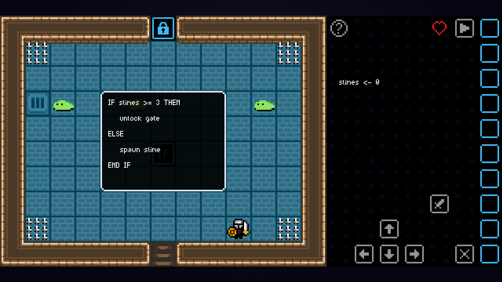
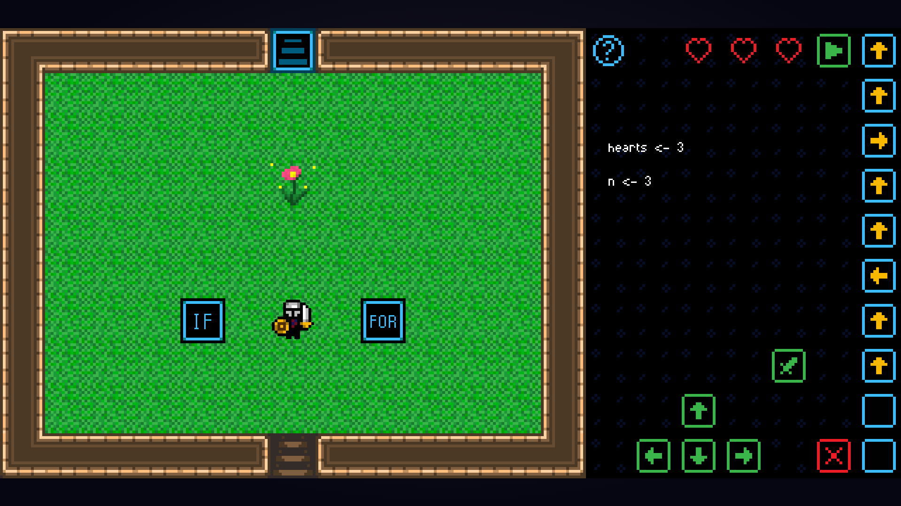

# Game-Based Learning Application  

This project is an educational game designed to teach fundamental programming concepts through interactive gameplay. Players learn key programming structures, including **variables, operators, loops, and conditional statements**. Each concept is explained using pseudocode in a structured and engaging manner.  

---

## Project Purpose  

This project demonstrates:  
- **Game-based learning methodologies** to teach programming interactively.  
- **Implementation of programming logic** in a game development environment.  
- **User engagement strategies** through level-based challenges and progression.  
- **Proficiency in GameMaker Studio 2** and its scripting language, **GML (GameMaker Language)**.  

---

## Prerequisites  

To run this project, you will need **GameMaker Studio 2**. You can download the free edition from the official website:  

- [Download GameMaker Studio 2 (Free Edition)](https://www.yoyogames.com/get)  

---

## How to Open the Project  

1. Download and install **GameMaker Studio 2**.  
2. Open GameMaker Studio 2.  
3. Click **"Open Project"** and navigate to the project folder.  
4. Select the file **`Game-Based-Learning-Application.yyp`** to load the project.  
5. Run the game within GameMaker Studio 2.  

---

## Game Overview  

The game consists of multiple levels, each introducing a **new programming concept**. Players progress by solving puzzles that require understanding and applying these concepts.

### Features:  
- **Interactive Levels:** Each level introduces a new programming topic.  
- **Visual Programming Interface:** Players select inputs that execute like a program.  
- **Progression System:** Levels build on previous concepts, gradually increasing in complexity to reinforce learning.  
- **Final Challenge:** The final level features a boss fight where players must recognize the enemy’s attack patterns and answer programming-related questions to succeed.
- **Auto-Saving:** The game saves progress using a JSON file after each level.  

---

## Game Structure & Levels  

### 1. Main Menu  
The main menu provides the following options:  
- **Continue**: Resume a saved game.  
- **New Game**: Start a new playthrough.  
- **Quit**: Exit the game.  

**Main Menu Screenshot:**  
  

---

### 2. Initialization Room  
- Introduces the **game mechanics** and **basic controls**.  
- Instructions can be displayed by clicking the **blue `?` button**.  
- Players select movement and attack inputs via **green buttons**.  
- Selected inputs appear in the **yellow column** on the right.  
- Inputs can be canceled using the **red "`X`" button**.  
- The selected inputs execute one by one when the **green "`▶`" button** is clicked, simulating a step-by-step program execution.  

**Initialization Room Screenshot:**  
  

---

### 3. Story Introduction (House)  
- An NPC introduces the **game’s storyline**:  
  - A friend has become **lost in the dungeon**.  
  - Players must **learn and apply programming concepts** to rescue them.  

**Story Introduction Screenshot:**  
  

---

## 4. Learning Levels  

Each level introduces a **specific programming concept** through a text box. The explanations can be visualized any number of times by clicking on the **`?`** button. If the player takes too much damage or the level becomes impossible to complete due to in-game logic, the level restarts automatically. These levels include:

### **4.1 Variables**  
- Players track a **`slimes`** variable, which increases when enemies are defeated.  

**Variables Level Screenshot:**  
  

---

### **4.2 Operators**  
Players must use gameplay mechanics to meet **specific logical conditions** and unlock in-game gates. The player can click on the locked gates to see these conditions.  

This concept is introduced across three progressively challenging levels:  
- **4.2.1 Comparison Operators:** Covers `=`, `<`, `>`, `<=`, `>=`, and `<>`.  
- **4.2.2 Arithmetic Operators:** Includes addition, subtraction, multiplication, and floating-point division.  
- **4.2.3 Logical Operators:** Introduces `AND`, `OR`, and `NOT` operations.  

**Logical Operators Level Screenshot:**  
  

---

### **4.3 Quiz**  
- A recap level designed to reinforce previously learned concepts.  
- Questions are selected randomly.  

**Quiz Level Screenshot:**  
  

---

## **4.4 Control Structures**  

In these levels, the player can interact with blocks labeled with their respective programming structures. Players can click on these blocks to see their code and can hit the blocks to activate them.  

### **4.4.1 If Statement**  
- Introduces the **if/else statement**.  
- The **if/else condition** checks the number of **`slimes`** the player has defeated.  
- If the condition is met, the level either **spawns a slime** or **opens the door** to the next level.  

**If Statement Level Screenshot:**  
  

---

### **4.4.2 While Loop**  
- Introduces the **while loop** and includes an **if statement**.  
- The **if block** changes the direction of a slime.  
- The **while loop** moves the slime **until it hits a wall**.  
- To complete the level, players must coordinate the slime to land on a **set of spikes** using these structures.  

**While Loop Level Screenshot:**  
  

---

### **4.4.3 Repeat Until Loop**  
- Introduces the **repeat until loop**.  
- The **repeat until block** is already running when the level begins.  
- Players must collect **three coins** while avoiding **bats** that fly around the room.  
- Once all coins are collected, the **repeat until condition stops the bats**.  
- The exit gate unlocks, but the stopped bats block the way.  
- To exit, the player must **reactivate the repeat until block** so the bats move again. Since the coins have already been collected, the loop executes **once** before stopping again, allowing safe passage.  

**Repeat Until Loop Level Screenshot:**  
  

---

### **4.4.4 For Loop**  
- Introduces the **for loop** and includes an **if statement**.  
- The **if block** changes the value of **n**, which determines how many times the **for loop executes**.  
- The **for loop** is responsible for **watering a plant n times**.  
- The objective is to **water the plant a specific number of times** to complete the level.  

**For Loop Level Screenshot:**  
  

---

## 4.5 Final Challenge  

- The **final boss fight** tests the player's programming knowledge.  
- The boss enemy moves and attacks in a set pattern. Players must learn and anticipate this pattern to land successful attacks.  
- When the player attacks the boss, a window pops up with a **random programming-related question** from all learned subjects.  
- If the player answers correctly, the boss takes damage.  
- If the player answers incorrectly, the player takes damage instead.  
- Completing this challenge signifies that the player has mastered the fundamental programming concepts introduced in the game.  

**Final Challenge Screenshot:**  
  

---
