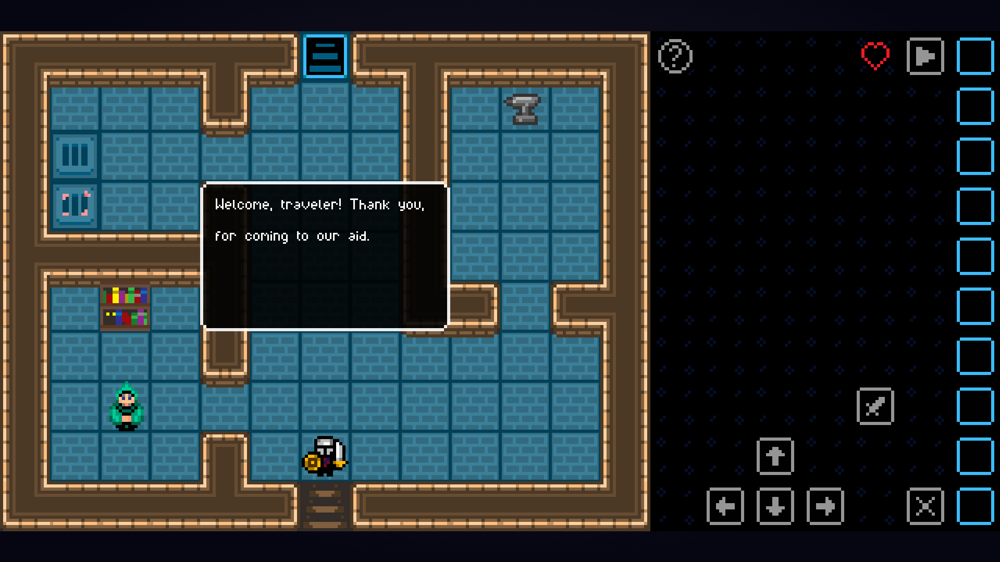

# Game-Based Learning Application

This is a game designed to teach programming concepts to beginners through gameplay. The game walks players through basic programming structures and operations such as variables, operators, loops, and conditional statements, all explained in pseudocode.

## Prerequisites

To run this project, you will need **GameMaker Studio 2**. You can download the free edition from the official website here:

- [Download GameMaker Studio 2 (Free Edition)](https://www.yoyogames.com/get)

## How to Open the Project

1. Download and install GameMaker Studio 2 (Free Edition).
2. After installation, open GameMaker Studio 2.
3. In the GameMaker Studio 2 interface, select **"Open Project"**.
4. Navigate to the project directory and select the **`Game-Based-Learning-Application.yyp`** file. This file contains the project structure and will allow you to open, run, and edit the project.

## Game Overview

The game consists of various levels that teach programming concepts using pseudocode. It is aimed at beginners, providing an interactive and engaging way to learn the fundamentals of programming. Here’s an overview:

1. **Menu**: Choose from "Continue", "New Game", and "Quit Game". The game saves automatically in a JSON file after entering a new room.

3. **Initialization Room**: This room initializes global variables and provides a **`?`** button that teaches basic controls like movement and attack. In order to move, the player needs to select their inputs by clicking the green buttons on the screen. To cancel their selection, they can click on the red **`X`** button on the screen. In order to run thier selected inputs, the player can click on the green **`▶`** button on the screen

5. **House**: The NPC introduces the game’s story and sets the goal of rescuing his friend, who got lost in the dungeon. To succeed, the player must learn and apply programming concepts.

7. **Levels**: In order to progress, the player must solve different puzzles related to the different programming concepts that the levels are focused on. Each level introduces a new concept through a text explanation. Whenever they need help, the player can visualise these explanations again by clicking the blue **`?`** button on the screen. The levels of the game include:

   - **Variables**: The player can play around and get used to the controlls while observing that each time they defeat a slime, the **`slimes`** variable goes up on the screen.

   - **Comparison Operators**: The player can click on the locked gates to see the different logical conditions that they need to fulfill in order to progress.

   - Arithmetic Operators
   - Logical Operators
   - If, While, Repeat Until, and For loops
   - A quiz on the previously learned concepts.
   - **Final Boss**: A challenge where the player answers programming-related questions to defeat a boss and complete the game.

## Have Fun!

Enjoy the game and have fun learning programming!
